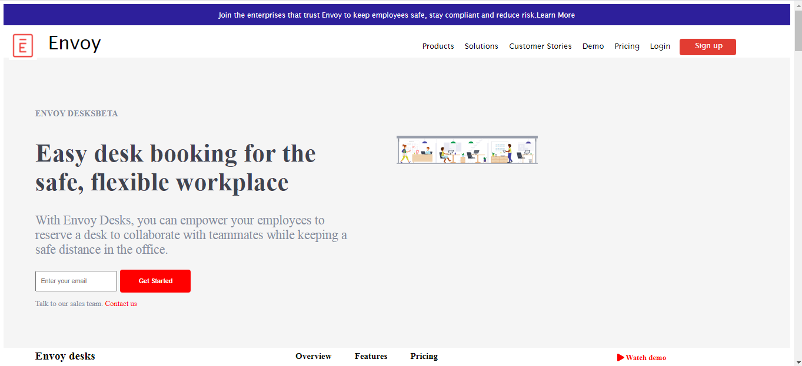

<h4>We have cloned Envoy, Envoy is a digital plateform that handles delivery at doorstep of all logistics and office related things.</h4>
This is more of a static website as we used more of Html, Css and a little Javascript.

This is landing page.

<a href="" target="_blank">Visit here to see live website.</a>

  

<a href="https://afzal95.github.io/envoy/index.html" target="_blank">You can visit site here.</a>

### Technologies Used  
HTML 5  
CSS 3  
Javascript  

### Features
<h5>Signup page</h5>
<h5>Login page</h5>
<h5>Home page</h5>
<h5>Products page</h5>
<h5>Solution page</h5>

<h4>Team Members</h4>
<ul>
    <li>1. Afzal Ahmad</li>
    <li>2. satwik Naik</li>
    <li>3. Pavisha Kulal</li>
    <li>4. Manohar</li>
</ul>
